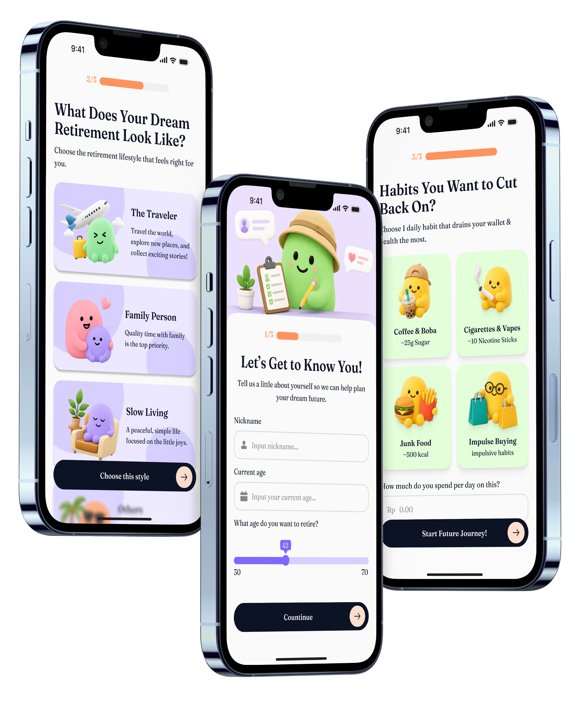

<div align="center">

  

  <p align="center">
    
  </p>

  # Retire Me!

  **A gamified mobile application designed to help young adults plan for retirement and build healthy habits through daily check-ins.**

  <br />

  
  
  

</div>

---

## Table of contents

- [Project overview](#project-overview)
- [Key features](#key-features)
- [Technology stack](#technology-stack)
- [Project structure](#project-structure)
- [Team](#team)

## Project overview

| Item | Details |
| --- | --- |
| Application Type | Mobile Application |
| Primary Platform | Android & iOS |

"Retire Me!" is an offline-first, gamified retirement preparation app targeted at young adults and professionals. It solves the problem of delayed financial and health planning by turning daily habit tracking—like avoiding junk food, saving small amounts of money, or completing life pillar missions—into a rewarding game complete with EXP, level progression, and long-term compound interest projections.

## Key features

| Feature | What the user can do |
| --- | --- |
| **Gamified Onboarding** | Choose a retirement archetype and a "Guilty Pleasure" to avoid daily. |
| **Daily Check-in** | Evaluate 4 life pillars (Financial, Health, Social, Purpose) and confirm habit avoidance to earn EXP. |
| **Compound Interest Projection** | Visualize estimated future retirement funds based on real daily savings. |
| **Health Metrics Conversion** | Track tangible lifetime health impacts (e.g., avoided sugar grams or nicotine sticks). |
| **Dynamic Avatar & Badges** | Level up the "Future Avatar" and unlock achievement badges based on consistency. |
| **Daily Mini Missions** | Complete simple daily tasks across the 4 pillars to boost weekly EXP. |


## Technology stack

| Category | Technology | Purpose |
| --- | --- | --- |
| Frontend | Flutter & Dart | Cross-platform UI Development |
| Architecture | Feature-based Architecture | Scalability and code organization |
| State Management | Provider | Managing global and local application state |
| Backend & DB | Shared Preferences / Hive | Offline-first data persistence (No Auth) |
| Data Visualization| fl_chart | Rendering Radar and Line charts for progress tracking |

## Project structure

```text
├── lib/
│   ├── core/         # Shared utilities, constants (colors), and universal widgets
│   ├── models/       # Data schemas (e.g., user_profile_model.dart)
│   ├── features/     # Feature modules
│   │   ├── onboarding/  # Archetype & Habit selection
│   │   ├── home/        # Dashboard & Daily Check-in logic
│   │   ├── progress/    # Lifetime projections and charts
│   │   ├── report/      # Weekly reports and mini-missions
│   │   └── profile/     # Settings and unlocked badges
│   └── main.dart     # Entry point of the application
├── assets/           # Images, avatars, and custom icons
└── pubspec.yaml      # Project dependencies
## Getting Started

To get a local copy up and running, follow these simple steps.

### Prerequisites

*   Flutter SDK installed on your machine.
*   An editor like VS Code or Android Studio.

### Installation

1.  **Clone the repo**
    ```sh
    git clone [https://github.com/punpun41/retire-me-app.git](https://github.com/punpun41/retire-me-app.git)
    ```
2.  **Navigate to the project directory**
    ```sh
    cd retire_me
    ```
3.  **Install dependencies**
    ```sh
    flutter pub get
    ```
4.  **Run the app**
    ```sh
    flutter run
    ```

---

## Team

| Name | Role | Responsibilities | Contact |
| --- | --- | --- | --- |
| Johanes de Brito Farrell Sirait | Mobile Engineer | App architecture, state management, UI slicing, and local database implementation |  |
| Kania Khalifa Kurniadi | UI/UX Designer | High-fidelity prototyping, design system, and asset illustration |  |
| Alya Dhamierea Islamay Putri | Product Manager | User research, PRD formulation, and project management |  |
